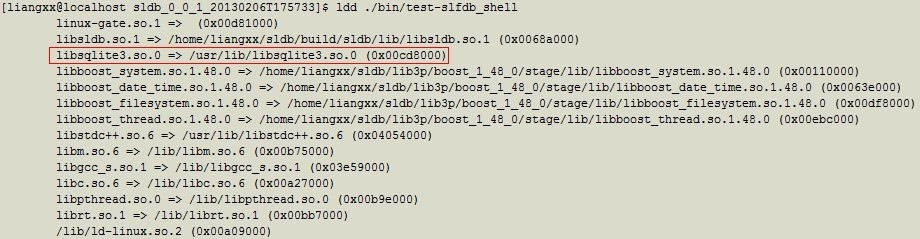
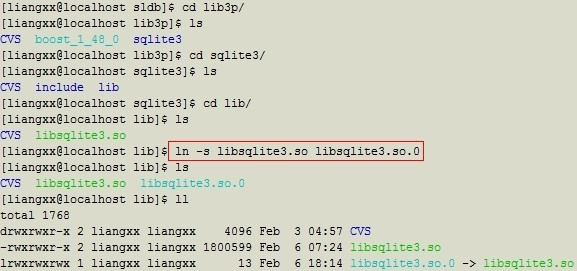

[原文链接](http://www.cnblogs.com/liangxiaxu/archive/2013/02/07/2908562.html)

环境：redhat enterprise linux 5 (server version) 

项目中的lib3p目录下放置了sqlite共享库libsqlite3.so

cmake文件已经指定了lib3p路径

运行项目生成的可执行文件时报错：

./bin/test-slfdb_shell: symbol lookup error: /home/liangxx/sldb/build/sldb/lib/libsldb.so.1: undefined symbol: sqlite3_backup_init

百度到的结果是可执行文件链接的共享库可能不正确，也就是说链接到的不是lib3p下的libsqlite3.so，而是/usr/lib下的旧版本libsqlite3.so，但是cmake已经正确指定了lib3p路径，所以排除了这个可能。

那么到底是什么原因呢？从百度中学到一个命令ldd，这个命令可以查看可执行文件链接到的动态库情况，于是我检查了一下：

可以发现原来可执行文件链接的sqlite共享库命名是libsqlite3.so.0，在lib3p下找不到libsqlite3.so.0命名的共享库，所以转向默认的路径（/usr/lib）去查找，于是就连接到系统自带的旧版本sqlite共享库。

解决方法很简单，进入到lib3p文件夹下，执行软连接命令生成名字为libsqlite3.so.0的文件：

重新运行，木有问题了。